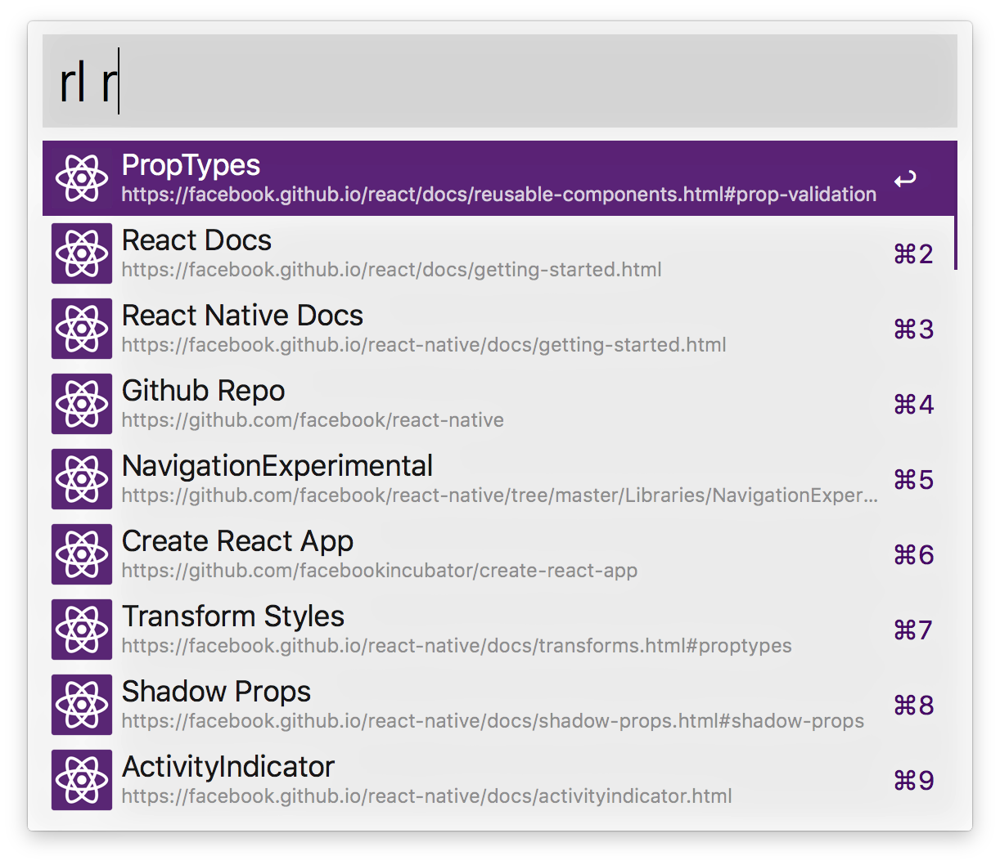

# Alfred React Lanucher

Alfred 3 workflow to access the React & React Native Documentation and community links.

### Download

Download the workflow from [GitHub](https://github.com/winkerVSbecks/alfred-react-launcher/releases/download/v1.0.0/react-launcher.alfredworkflow) or [Packal](http://www.packal.org/workflow/react-launcher).
Requires Node.js 4+ and Alfred Powerpack.

### Usage

To search, type `rl`, <kbd>Enter</kbd> and your query. Select a component and press <kbd>Enter</kbd> to go to open the URL.

